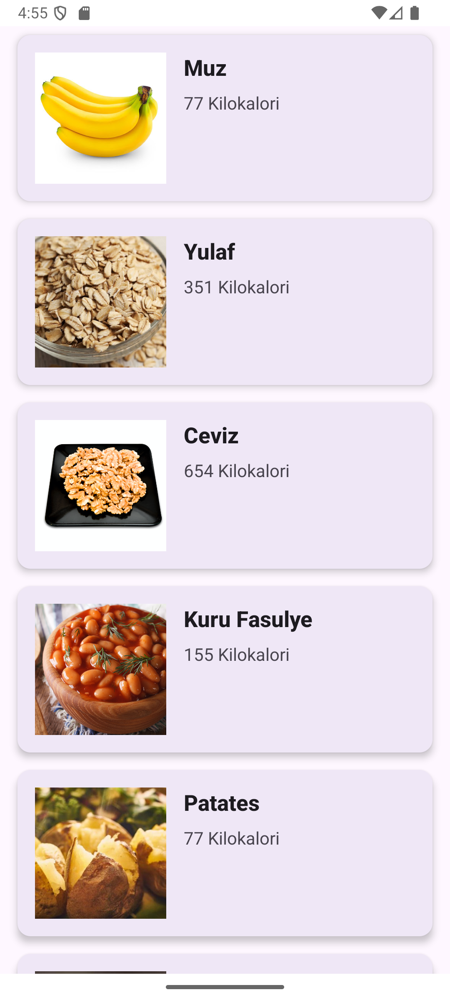
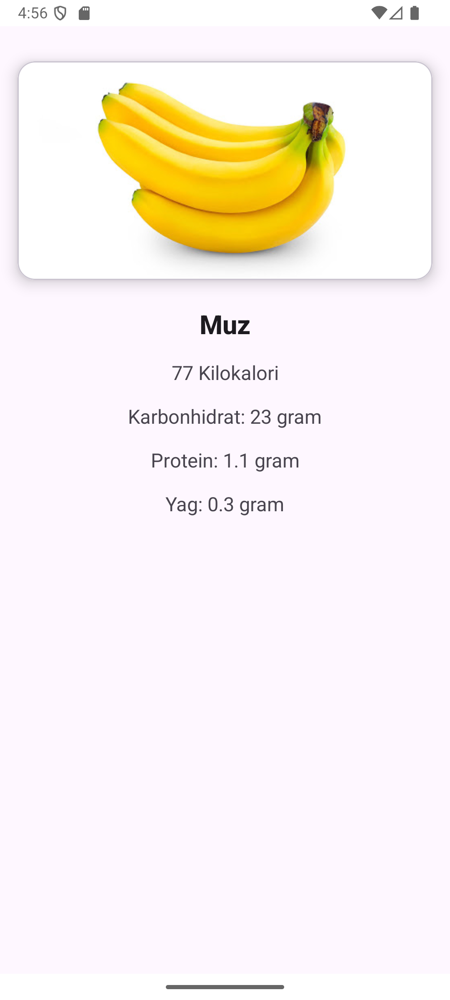

# 🍎 Nutrition Info Android App

This is an Android application that fetches nutritional information via an API and displays it using RecyclerView. It also automatically loads and displays images associated with each food item.

## 📱 Features

- Fetches nutritional data (name, calories, protein, carbohydrates, fat, and image) from a remote JSON API.
- Caches data locally using Room Database for offline access.
- Displays food list in a RecyclerView.
- Navigates to a detail screen for each item.
- Uses Glide for image loading with placeholders.
- Swipe-to-refresh functionality to manually fetch updated data.
- Smart caching using SharedPreferences to reduce unnecessary network calls.

## 🔧 Technologies Used

- **Kotlin**
- **Retrofit** – Network communication
- **Gson** – JSON parsing
- **Room** – Local database
- **MVVM** – Architecture pattern
- **LiveData & ViewModel** – For reactive UI
- **Glide** – Image loading
- **SharedPreferences** – For simple caching
- **ViewBinding** – Safer and cleaner view access


## 🗂 Project Structure

```
com.example.besinprojesi/
├── adapter/              # RecyclerView Adapter
├── model/                # Data model class (Besin)
├── roomdb/               # Room database and DAO
├── service/              # Retrofit API service
├── util/                 # Utility methods (image loading, shared prefs)
├── view/                 # Fragments (List and Detail)
└── viewmodel/            # ViewModels for MVVM pattern
```

## 📸 Screenshots

<p align="center">
  
  &nbsp;&nbsp;
  
</p>

## 🚀 Getting Started

### Prerequisites

- Android Studio Flamingo or later
- Android SDK 33+
- Internet connection for fetching API data

### Installation

1. Clone this repository:
   ```bash
   git clone https://github.com/your-username/NutritionApp.git
   ```
2. Open the project in Android Studio.
3. Run the app on an emulator or physical device.

## 📂 Important Files

- `BesinListesiViewModel.kt`: Handles fetching and caching data.
- `BesinRecyclerAdapter.kt`: Binds nutritional data to RecyclerView.
- `BesinAPI.kt`: Retrofit interface for the API.
- `BesinDatabase.kt`: Singleton Room database implementation.
- `OzelSharedPreferences.kt`: SharedPreferences helper for caching time.
- `BesinDetayFragment.kt`: UI and logic for food detail screen.

## 🧠 Caching Strategy

- Checks if the last API fetch was less than 10 minutes ago.
- If so, loads data from Room database.
- Otherwise, fetches fresh data from the API and updates the Room database.

## 🧪 Testing

To test:

- Launch the app.
- Observe the list view with food items.
- Tap an item to view detailed nutrition info.
- Swipe down to manually refresh the data.

## 🤝 Contributing

Pull requests are welcome.

## 📝 License

This project is open-source and available under the [MIT License](LICENSE).

---

## ✍️ Author

**Kerem Levent**  
📧 [keremleventt@gmail.com](mailto:keremleventt@gmail.com)  
🔗 [LinkedIn Profile](https://www.linkedin.com/in/keremlevent/)
  
---

*Developed as a Kotlin Android project for educational purposes.*
